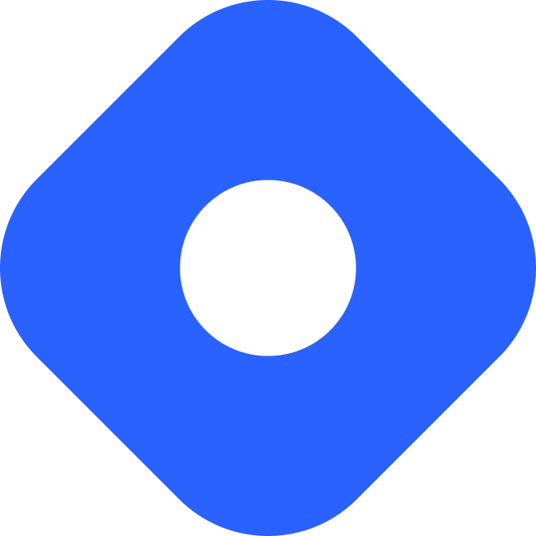

##    Hi, I am Jaideep! Glad to see you here!

 </img>

- 👋  Hi, I’m Jaideep Guntupalli.
- 🏫  I graduated with a B.Tech in Computer Science and Design from [IIIT Delhi](https://iiitd.ac.in).
- 👀  I am a tech enthusiast & an open-source advocate.
- 🥅  My Goal for the next few months to try and contribute more to open source.
- ⚡ Fun fact: I love Formula One.

## 🛠 Tools I worked with:

  
  
  
  
  
  
  
  
  
  
  
  
  
  
  
  
  
  
  
  
  
  

 

## 🤝 Connect with me:

 
 

----

<!-- 

 -->

----

	
  
  

